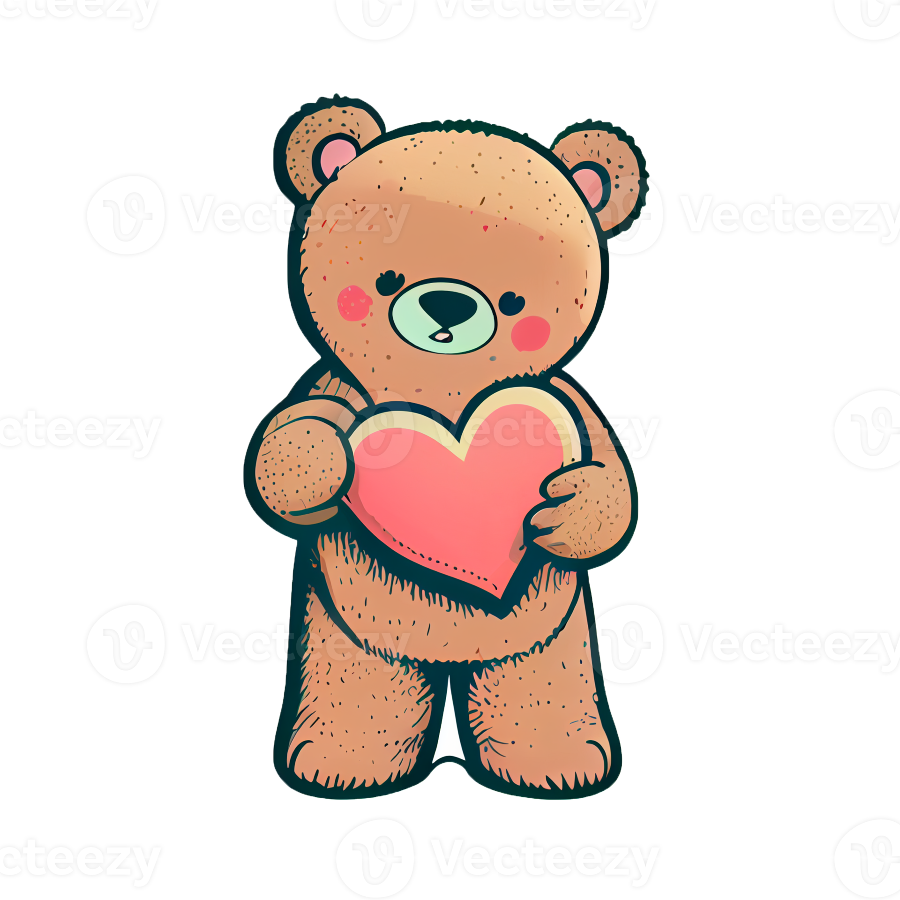

<!DOCTYPE html>
<html lang="en">
<head>
<meta charset="UTF-8">
<title>Just a Little Surprise 🌸</title>
<meta name="viewport" content="width=device-width, initial-scale=1.0">

</head>

<body>

<audio id="bgMusic" loop>
  <source src="everlasting.mpeg" type="audio/mpeg">
</audio>

<!-- QUESTIONS -->
<section id="q1" class="active">
  <h2>Are you happy to go through this little surprise session? 💕</h2>
  <button onclick="yes(1)">Yes</button>
  <button onclick="no()">No</button>
</section>

<section id="q2">
  <h2>Am I someone you truly love and care about? 🥹💖</h2>
  <button onclick="yes(2)">Yes</button>
  <button onclick="no()">No</button>
</section>

<section id="q3">
  <h2>Do you feel this birthday will be happier than the previous years? 🎂✨</h2>
  <button onclick="yes(3)">Yes</button>
  <button onclick="no()">No</button>
</section>

<section id="q4">
  <h2>Do you think this will be a good surprise for you? 🎁🌺</h2>
  <button onclick="yes(4)">Yes</button>
  <button onclick="no()">No</button>
</section>

<!-- TEDDY ANIMATION -->

<!-- MESSAGE -->
<section id="message" class="fade">
  <h1>💖 Happy Birthday Alliiii 💖</h1>
  

    Your answers already made me smile.  
    This little page is just a reminder of how special you are,  
    how loved you are, and how grateful I am to have you.
    <strong>Many more happy returns of the day, Alliiii 🤍</strong>  
    I don’t really know how to express all this love on your birthday. 
    I know it’s your special day, but for me, I’ve been excited about this day for a long time.  
    I just want to fill this birthday with happiness and smiles for you. 
    Stay happy always.  
    Whatever happens, I’ll be there for you whenever you need me. 🌷
  

  <button onclick="playMusic(); showGallery()">Continue 🌸</button>
</section>

<!-- GALLERY -->
<section id="gallery" class="fade">
  <h2>🌺 Moments 🌺</h2>
  

    
    
    
    
</section>

</body>
</html>
